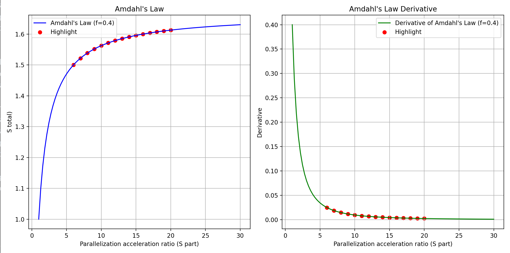

### 1. 
**(a) (b) (d)**
### 2.
弱一致性模型的主要考虑原因是为了在分布式系统中实现更好的性能和可伸缩性。在分布式系统中，多台计算机共同完成一个共同的目标，确保一致性（确保所有节点对数据具有相同的视图）会涉及到性能、可用性和容错性方面的权衡。

考虑弱一致性模型的主要原因是为了放宽强一致性的严格要求（所有节点同时看到相同的数据）。强一致性的保证可能导致增加延迟和降低可用性，特别是在节点可能地理分布广泛的大规模分布式系统中。

相反，弱一致性模型允许在节点之间更灵活地复制和同步数据。这种灵活性能够提高并行性，减少通信开销，并提高容错性。通过接受一定程度的不一致性，允许节点使用本地缓存或过时的数据运行，弱一致性模型能够在不需要绝对一致性的情况下提供更高的性能和可用性。

### 3. 
分布式系统中的计算机通常位于不同的地理位置，通过网络进行通信。计算机时钟同步可以确保分布式系统正常运行和协同工作的基础。它有助于维护一致的时间基准，使得系统中的各个组件能够按照协定的时间顺序执行操作，从而提高系统的可靠性和可维护性。以下是若干原因阐述为什么计算机时钟同步是必要的：

1. **事件协调：** 许多分布式系统中的事件需要按照时间顺序发生，或者需要在某个时间戳上进行记录。若各计算机的时钟不同步，事件的顺序可能会混乱，导致系统无法正常协调。

2. **日志和故障排查：** 在分布式系统中，记录日志是排查故障和进行系统分析的关键。时钟同步确保日志中的时间戳是一致的，有助于准确追溯事件和分析问题。

3. **安全性：** 许多安全协议和机制依赖于时间戳来验证和控制访问。若时钟不同步，可能会导致安全性漏洞，例如在验证过期证书或令牌时出现问题。

4. **协同工作：** 在分布式系统中，不同计算机可能需要协同工作来完成任务。时钟同步是确保各个节点在同一时间进行协同操作的关键，以避免数据不一致或冲突。

5. **避免数据不一致：** 在分布式数据库和文件系统等应用中，时钟同步有助于避免因为不同节点的时钟差异而导致数据的不一致性。

以下是分布式系统中时钟同步系统的设计要求：

1. **一致性：** 系统需要确保各个计算机的时钟保持一致。这有助于协调分布式系统中的操作，防止因时间不一致而导致的错误和混乱。

2. **精度：** 时钟同步系统应该提供足够的精度，以满足系统中各个应用的需求。不同的应用可能需要不同级别的时钟精度。

3. **容错性：** 时钟同步系统应该具备一定的容错性，以应对可能出现的网络延迟、时钟漂移或其他故障。容错性能够确保即使在一些异常情况下，时钟同步系统仍然能够提供合理的时间同步。

4. **可扩展性：** 设计时钟同步系统时需要考虑到系统规模的变化。系统应该能够适应增加或减少节点的情况，而不会显著影响时钟同步的性能。

5. **安全性：** 时钟同步系统需要考虑安全性问题，防止恶意攻击或未经授权的访问。确保时钟同步的信息在传输过程中是安全的，并且系统能够抵御潜在的攻击。

6. **实时性：** 对于一些实时系统，时钟同步需要提供及时的响应，以确保系统中的事件能够按照预期的时间顺序发生。

### 4.

要找到归并排序算法的最佳性能点，我们需要确定能够使总运行时间最小化的核心数。最佳性能点出现在并行化带来的收益抵消了使用更多核心时的开销和递减收益的情况。

设$P$为算法的并行部分，$S_{part}$为并行化该部分获得的加速比。根据阿姆达尔定律，总体加速比$S_{all}$ 为：

$ S_{all}$ = $\frac{1}{{(1 - P) + \frac{P}{S_{part}}}} $

其中，$P$为并行部分的比例，$S$为并行化该部分获得的加速比。在这里，我们假设并行部分的比例为40%（0.4），而加速比$S$分别为4（6核计算机），5（10核计算机）和8（20核计算机）。

我们可以计算不同核心数下的总体加速比，找到其中最小的值，该值对应的核心数即为最佳性能点。
**6核计算机:**
$ S_{all} = \frac{1}{(1 - 0.4) + \frac{0.4}{4}} \approx 1.428 $
**10核计算机:**
$ S_{all} = \frac{1}{(1 - 0.4) + \frac{0.4}{5}} \approx 1.470 $
**20核计算机:**
$ S_{all} = \frac{1}{(1 - 0.4) + \frac{0.4}{8}} \approx 1.538 $

当然我们还需要考虑多核处理带来的开销，例如内存的带宽、通信开销等等

设置并行化的比例P=0.4，并将并行化部分加速比从6至20的点做标记

由图可知，估计最优点在**20核加速比为8倍**的附近
### 5. 
客户端要选服务器响应时间最短的往返时间设置时钟，即选择第三组，取Round-trip Time的一半10ms，也就是单程时间，从而可以估计当前时间，把这个时间加到Time（10:54:28.342）上，结果设为10:54:28.352。设置的准确度为$\pm$10ms。
若发送消息到接受消息的时间至少为8ms，时间仍为10:54:28:352，但准确度修改为$\pm$2s。